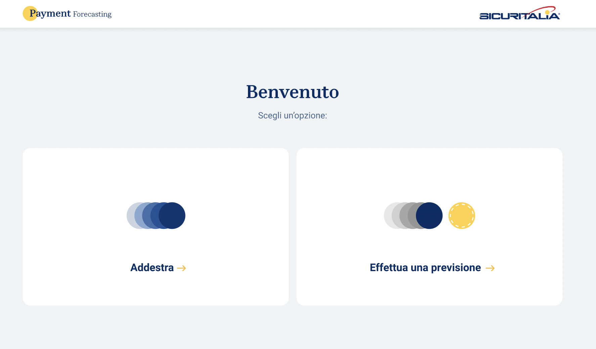
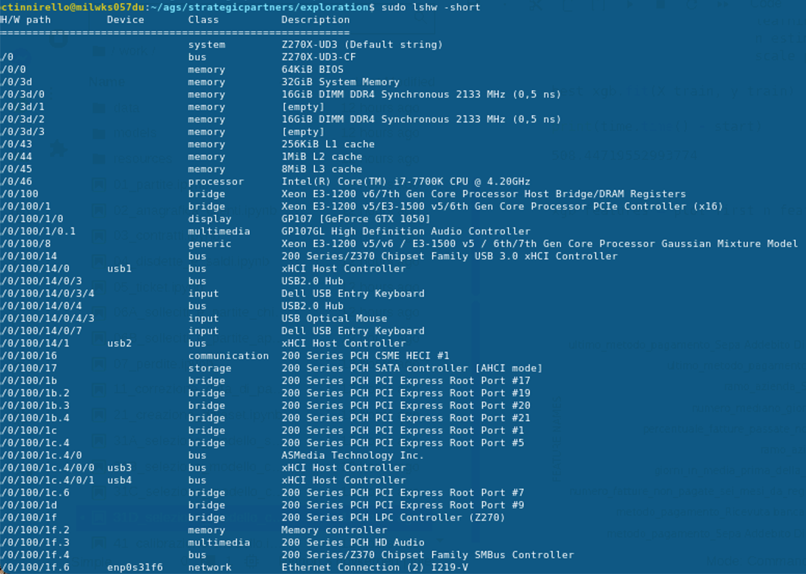

# product (Payment Forecasting)

[Mockup di funzionamento dell'applicazione](https://xd.adobe.com/view/eb03dfb6-65eb-4812-8f4f-1fc7e1723b69-be50/?fullscreen)

## Caratteristiche dell'applicazione

1. I file di input sono caricati ex-novo ad ogni addestramento;
2. Il formato ed il tipo di contenuto dei file di input per l'addestramento è il 
   medesimo usato finora. Sei file:
   - `partite.csv`
   - `anagrafica.xlsx`
   - `contratti.csv`
   - `disdette.csv`
   - `tickets.csv`
   - `solleciti.csv`
3. Dimensione orientativa dei file di input per addestramento: 1GB;
4. Autenticazione e gestione utenti non inclusa;
5. Estrazione feature richiede circa 10 minuti;
6. Addestramento richiede circa 10 minuti;
7. Pacchetto rilasciato: due container Docker, uno frontend e uno backend.

Le stime dei tempi di calcolo nei punti 5. e 6. sono state effettuate su una 
macchina 
con le seguenti caratteristiche:

## Stima durata progetto

- Durata: 5 settimane;

## Suggerimenti funzionalità aggiuntive

- Estrazione nuove feature dall'input attuale, per miglioramento prestazioni modelli (stima incremento prestazioni: +10%)
- Analisi di robustezza della procedura di calcolo della _feature importance_
- Interpretabilità avanzata del modello
- Diverso formato dei file di input (singolo file?)
- Riduzione dei tempi di estrazione feature ed addestramento
- Analisi approfondita della coerenza dei dati di input, per segnalare eventuali incoerenze
- Tracciamento storico dei modelli rilasciati e dei dati usati per il loro addestramento (verificare con il cliente per questioni interne di risk management su AI)
